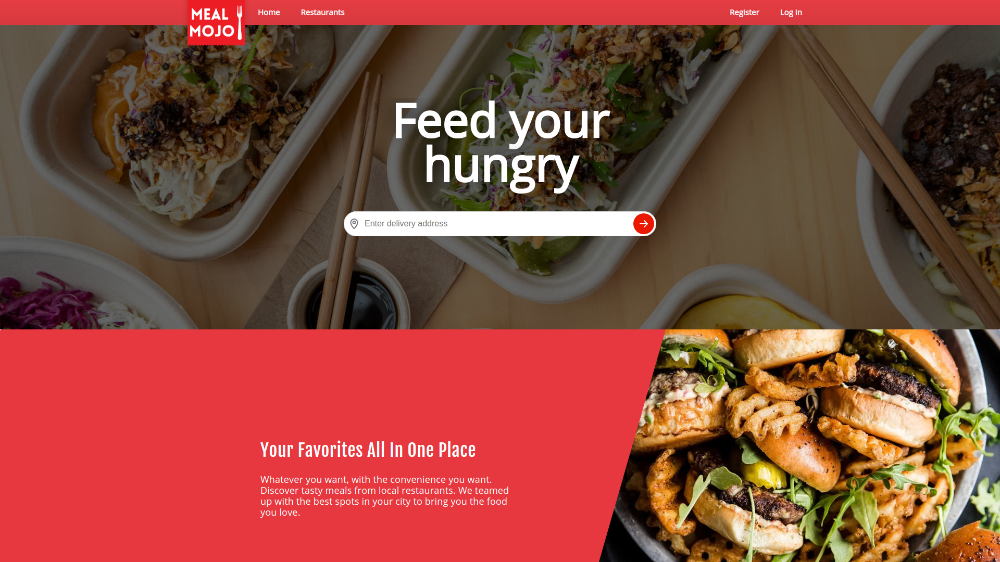
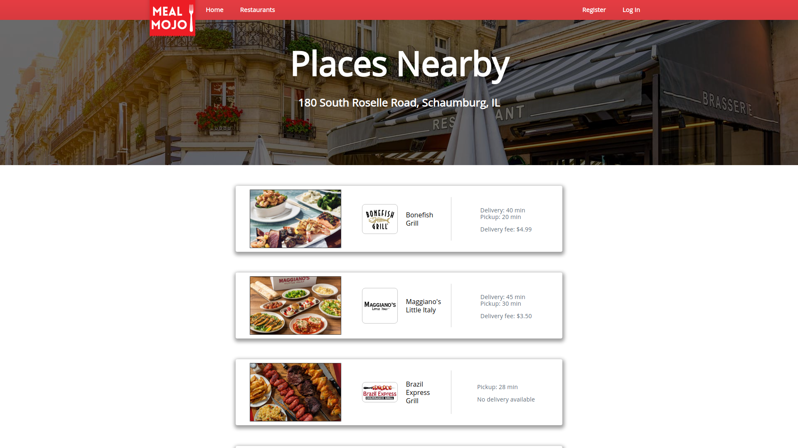
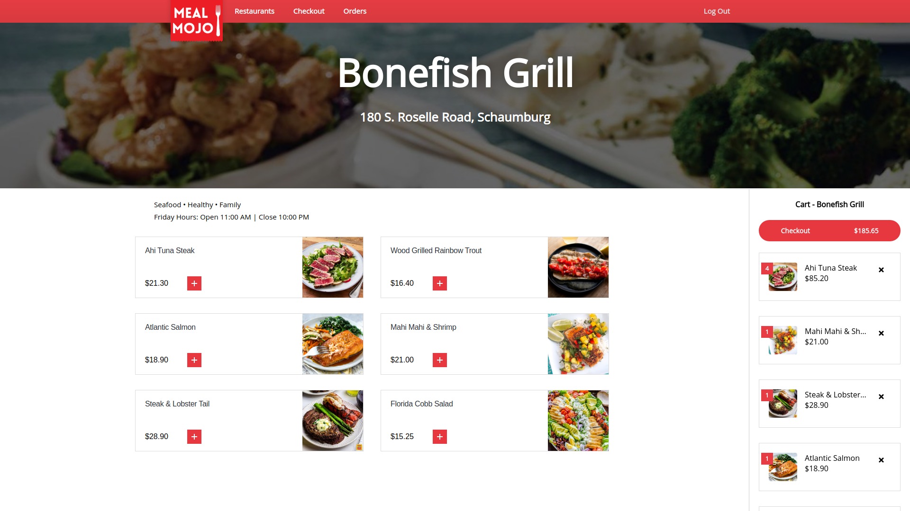
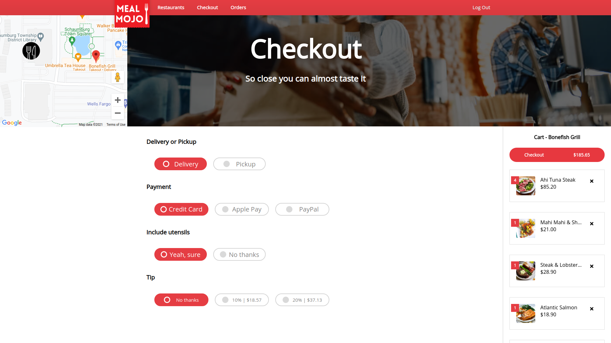
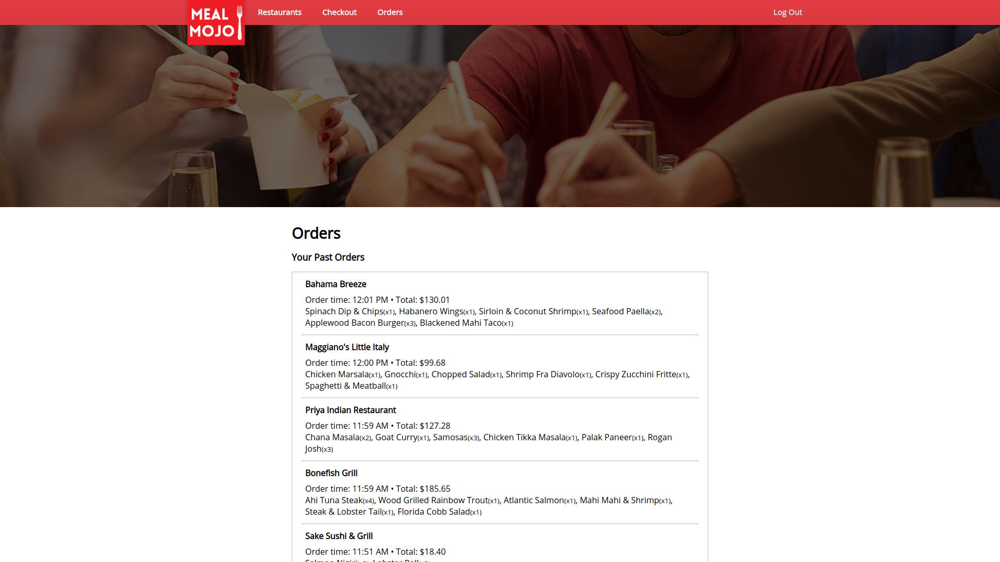

# Meal Mojo

A demo food ordering website built in <b>Angular 13</b>.  
The <b>backend</b> API for this app was built in Spring Boot. Check out the [backend repository here](https://github.com/qelery/Meal-Mojo-Backend-API).

Users are able to create an account, search for restaurants in their area, place orders, complete checkout, and view past orders. Uses NgRx to manage state, Jasmine for unit testing, and Cypress for e2e testing.

## Requirements
* Node version ^12.20.2 || ^14.15.5 || ^16.10.0 
* Angular CLI 13+
* A [Google Maps API](https://developers.google.com/maps) key

## Usage
* Clone and download the backend repository
* Start the backend server
* Place your Google API Key in the /src/index.html file
* Update the REST API url in the /src/environment.ts files
* Clone and download this repository
* Run `ng serve` in the terminal
* Navigate to `http://localhost:4200/` in the browser

## Screenshots
### Homepage

### Restaurants Results

### Restaurant Ordering

### Checkout

### Past Orders

### Homepage - full view

