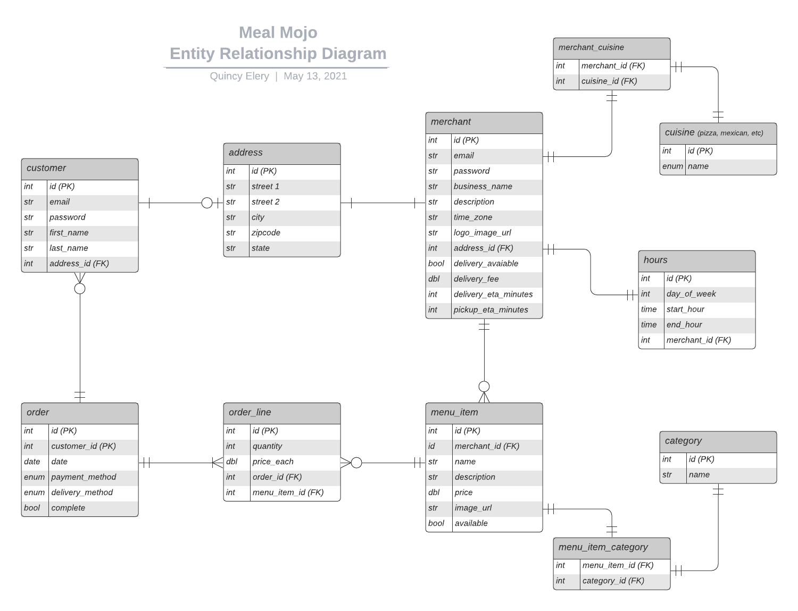

## Proposed General Idea

An online food ordering service where customers can choose from local restaurants. Restaurants can sign up for the "Merchant Portal" where they can view customer orders and a summary of sales.

## Wireframes

To be determined after backend API is built.

## User stories

Customer:
* As a Customer I want to be able to register using my first name, last name, email, and password.
* As a Customer I should be able to login with my email and password.
* As a Customer I want to be able to filter restaurants by pickup vs delivery.
* As a Customer I want to be able to filter restaurants by cuisine.
* As an Unregistered Customer I want to be prompted for my location.
* As a Customer I want to be able to filter restaurants by distance.
* As a Customer I want to be shown a list of menu items I can order from a restaurant.
* As a Customer I want to see general information like hours, delivery fee, etc. about a restaurant.
* As a Customer I want to be able to control the quantity of an item I add to cart.
* As a Customer I want a cart that shows items added and dollar amounts.
* As a Customer I want to be able to remove and edit quantity of items in my cart.
* As a Customer I want to be able to view a map that shows restaurants near me.

Merchant:
* As a Merchant I want to be able to register with email, password, business name, and physical address.* As a Merchant I want to be able to login with my email and password.
* As a Merchant I want to be able to view a summary of past sales.
* As a Merchant I want to be able to view pending orders.
* As a Merchant I want to be able to close pending orders.
* As a Merchant I want to be able to filter past customer orders.

## Tentative ERD

